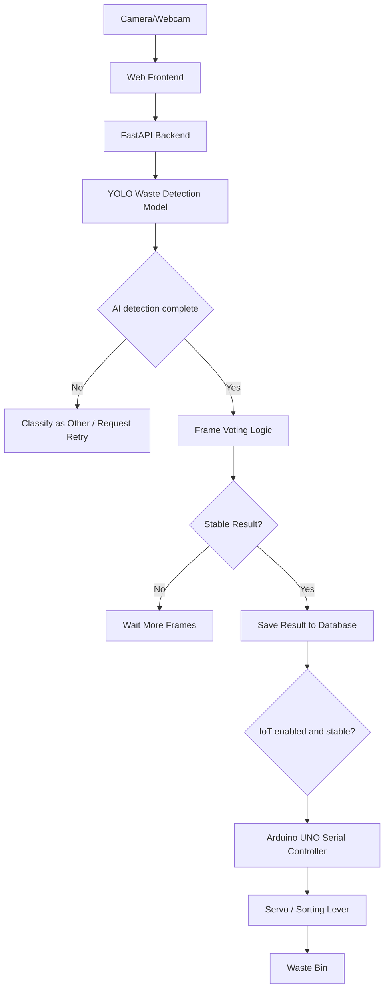

# AI-IoT-Waste-Sorting-System

Web system for automatic waste classification with camera AI and IoT servo sorting.

## Features

- React dashboard with realtime webcam capture, upload detection, bounding box overlay, confidence, voting state, statistics, and history.
- FastAPI backend with OpenCV image decoding, YOLOv8 model loading, SQLite logs, and Arduino UNO servo gate control over USB Serial.
- Error reduction logic:
  - Accept only confident detections.
  - Low confidence is classified as `other`.
  - Uses an 8-frame voting window.
  - Gate command is triggered only when the same waste type is stable for at least 6 consecutive frames and `confidence >= 0.75`.
  - A 4 second cooldown avoids repeated gate commands for the same object.
  - Every result is saved to SQLite and backend logs.
- Arduino UNO SG90 servo sketch receives `O`, `R`, `I`, `H`, and `C` commands over Serial.
- Arduino UNO servo control is isolated in `backend/arduino_gate.py`; if the board is unplugged/offline, camera, YOLO detection, dashboard, history, and statistics keep running.

## Waste Classes

| Class | Vietnamese | Servo angle |
|---|---|---|
| organic | huu co | 20 |
| recyclable | tai che | 170 |
| inorganic | vo co | 120 |
| hazardous | nguy hai | 70 |
| other | khong chac chan | no auto move |

Manual center/reset uses `90` degrees. For automatic sorting, the SG90 moves smoothly to the target angle, holds for about 1000 ms, then returns to `90` degrees to wait for the next item.

## Architecture



## Backend Setup

```bash
cd backend
python -m venv .venv
.venv\Scripts\activate
pip install -r requirements.txt
uvicorn main:app --reload --host 0.0.0.0 --port 8000
```

For real YOLO/OpenCV inference, use Python 3.10-3.12 and install:

```bash
pip install -r requirements-ai.txt
```

Optional `.env`:

```env
ENABLE_IOT=true
IOT_ENABLED=true
SERVO_ENABLED=true
ARDUINO_SERIAL_PORT=COM3
ARDUINO_BAUD_RATE=9600
ARDUINO_COMMAND_DELAY_SECONDS=0.2
SERVO_CONFIDENCE_THRESHOLD=0.75
SERVO_STABLE_FRAMES=6
SERVO_COOLDOWN_SECONDS=4
ESP8266_COMMAND_COOLDOWN_SECONDS=4
IOT_COOLDOWN=4
IOT_TIMEOUT_SECONDS=2
IOT_TIMEOUT=2
CONFIDENCE_THRESHOLD=0.35
GATE_CONFIDENCE_THRESHOLD=0.75
VOTING_WINDOW=8
STABLE_VOTES=6
STABLE_FRAME_REQUIRED=6
COOLDOWN_SECONDS=4
```

If `backend/models/best.pt` or AI dependencies are missing, the backend still starts and returns `other`/fallback results so the web app, database, and IoT flow can be tested.

## Frontend Setup

```bash
cd frontend
npm install
npm run dev
```

Open the Vite URL, usually:

```text
http://localhost:5173
```

If backend is not on `http://localhost:8000`, create `frontend/.env`:

```env
VITE_API_BASE_URL=http://your-backend-ip:8000
```

## Arduino UNO SG90 Servo Setup

1. Open [iot/arduino_servo_gate/arduino_servo_gate.ino](iot/arduino_servo_gate/arduino_servo_gate.ino) in Arduino IDE.
2. Install libraries:
   - Servo
3. Select Arduino UNO board and the correct COM port.
4. Upload to Arduino UNO.
5. Keep Arduino UNO connected to the laptop by USB.
6. Set backend `.env`:

```env
IOT_ENABLED=true
ARDUINO_SERIAL_PORT=COM3
ARDUINO_BAUD_RATE=9600
```

Servo wiring:

```text
Servo orange/yellow signal wire -> Arduino UNO D9
Servo red wire                  -> external 5V power supply
Servo brown/black wire          -> external power supply GND
External power supply GND       -> Arduino UNO GND
Arduino UNO USB                 -> laptop running AI
```

Do not plug the servo into the ICSP header. A light bench test can use the UNO 5V pin, but a real sorting lever should use an external 5V supply, and the Arduino UNO and servo supply must share GND.

Safe test flow:

1. Upload the Arduino UNO sketch.
2. Open Serial Monitor at `9600`.
3. Type these commands manually:

```text
O
R
I
H
C
```

4. Check Serial Monitor at `9600` for logs like `Organic detected -> servo 20 degree -> return 90 degree`.
5. Close Serial Monitor so the backend can use the same COM port.
6. Test backend APIs manually, then enable automatic YOLO triggering with `SERVO_ENABLED=true`.

Automatic servo triggering rules:

- `confidence >= 0.75`
- same 4-class waste type stable for at least 6 frames
- cooldown of 4 seconds before repeating the same type
- low confidence, unknown, or `other` does not move the servo
- after each valid sort command, the servo returns to `90` degrees automatically

## API

| Method | Endpoint | Description |
|---|---|---|
| GET | `/` | Health and config |
| POST | `/api/detect` | Upload image frame and receive detection |
| POST | `/api/sort` | Manual sort command |
| POST | `/api/iot/gate/left` | Manual Arduino UNO gate-left test |
| POST | `/api/iot/gate/right` | Manual Arduino UNO gate-right test |
| POST | `/api/iot/gate/home` | Manual Arduino UNO gate-home test |
| GET | `/api/iot/status` | Arduino UNO connection, gate state, last command, and errors |
| GET | `/api/iot/check` | Send `STATUS` over Serial to check Arduino UNO |
| POST | `/api/servo/organic` | Move SG90 to 20 degrees |
| POST | `/api/servo/recyclable` | Move SG90 to 170 degrees |
| POST | `/api/servo/inorganic` | Move SG90 to 120 degrees |
| POST | `/api/servo/hazardous` | Move SG90 to 70 degrees |
| POST | `/api/servo/center` | Move SG90 to 90 degrees |
| GET | `/api/servo/status` | Servo connection, angle, last command, last waste type, and error |
| GET | `/api/stats` | Count by waste type |
| GET | `/api/history?limit=50` | Recent detection logs |
| POST | `/api/reset-voting` | Clear voting window |

## Additional Diagrams

- [System Architecture](diagrams/system_architecture.md)
- [AI Flow](diagrams/ai_flow.md)
- [IoT Flow](diagrams/iot_flow.md)
- [Sequence Diagram](diagrams/sequence_diagram.md)
